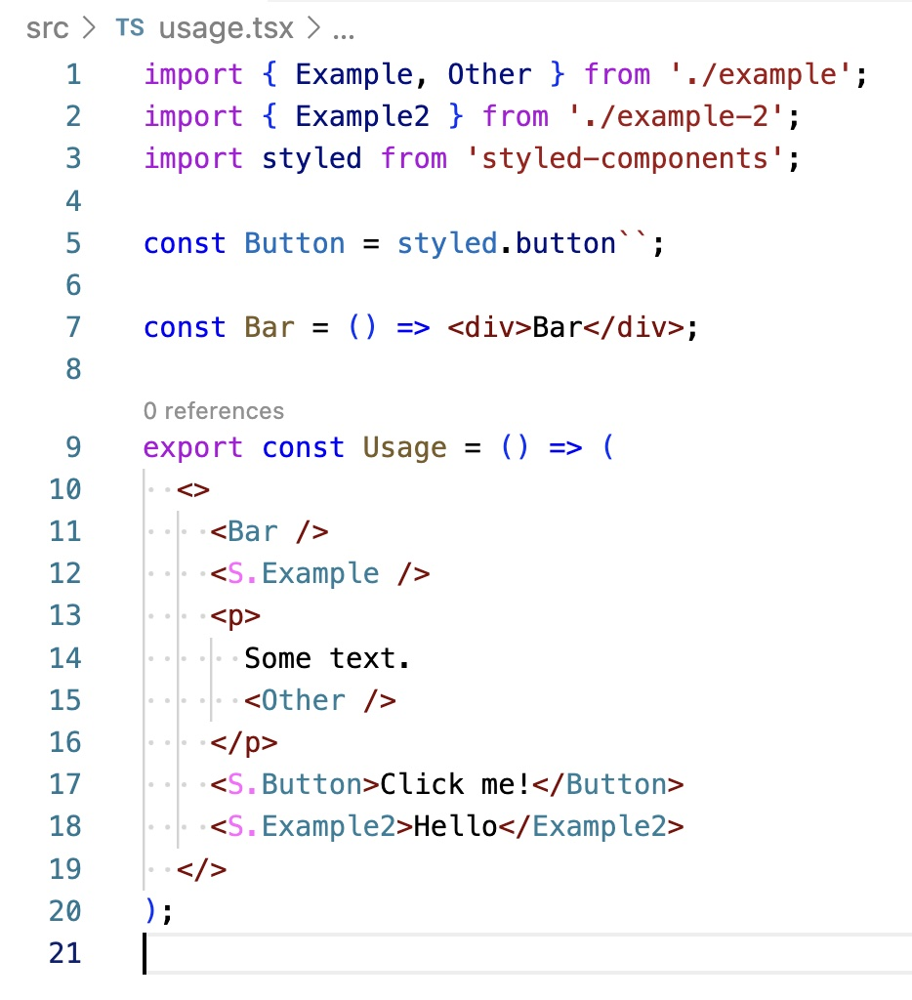

# vscode-styled-components-decorator

This is more a learning exercise then a real polished VS Code extension, but feel free to use it.

## Features

This extension will add a small pink `S.` in front of components that were ceated by styled-components.

## How to install?

TODO

## How to contribute?

- Clone the project and run `$ npm install` inside.
- Preview any changes by pressing `F5` within VS Code. This will compile the extension and launch it in an example project.
- Run `$ npm lint` if you made changes that you'd like to include.
